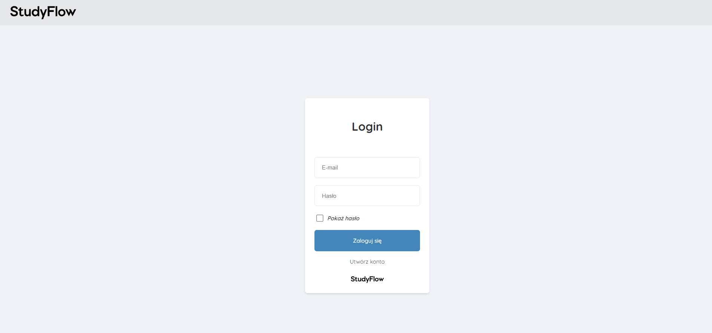
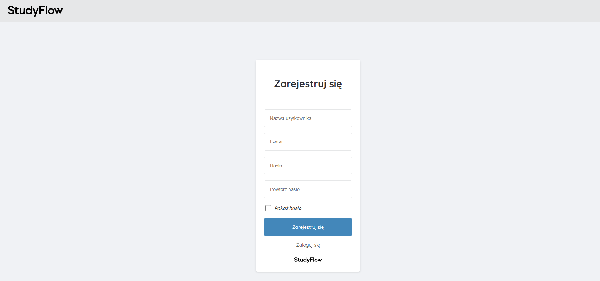
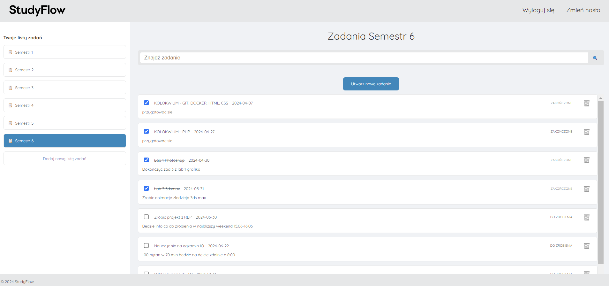
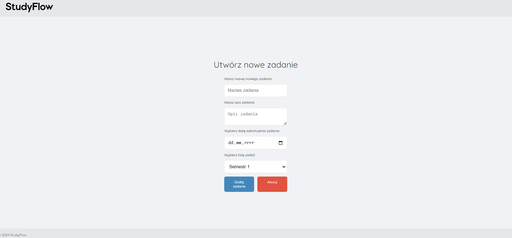
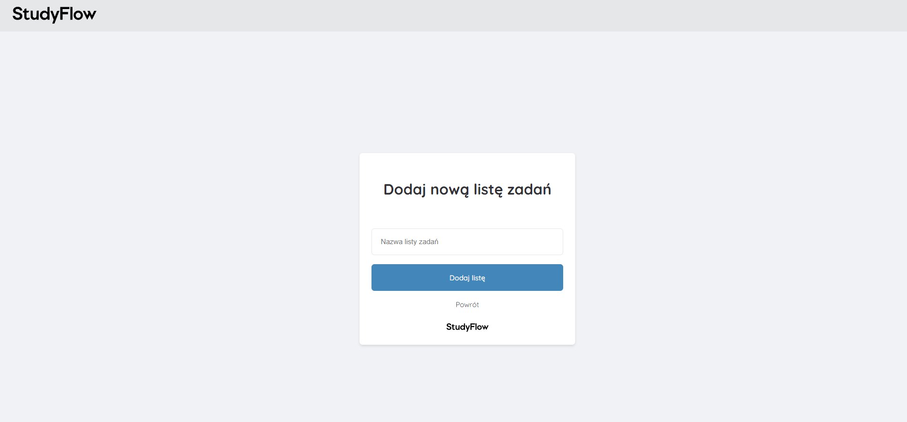
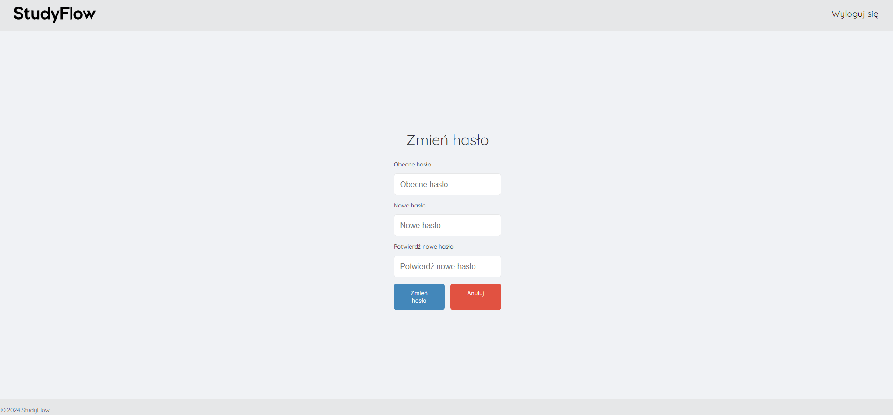

<p align="center">

</p>

# StudyFlow

Welcome to "StudyFlow" - a  platform designed to help you organize and track your tasks effortlessly, whether for personal projects or team assignments. StudyFlow ensures you stay productive and on top of your work!


# Features
- Task List Management: Create and manage multiple task lists effortlessly.
- Task Details: Each task includes information such as name, description, due date, and status.
- User Authentication: Secure account creation and management for handling your tasks.

# Technologies

Front-End:
- HTML, CSS, JavaScript

Back-End:
- PHP
- PostgreSQL

Server:
- Nginx

Containerization:
- Docker
- Docker Compose

Version Control:
- GitHub

# Requirements
- [Docker](https://www.docker.com/)


# Installation

1. Clone the repository from Github:

```
git clone https://github.com/tomasz-szalach/StudyFlow.git
```

2. Create an .env file, which includes database connection details. Do not forget to add this details in constructor in class Database.php.

```
DB_NAME=
DB_USER=
DB_PASSWORD=
DB_HOST=
```

3. Open terminal and run commands:

```
docker-compose build
```

```
docker-compose up
```

4. Access it by visiting http://localhost:8080 in your web browser.


# Entity-Relationship Diagram (ERD)

An ERD (provided as erd.png in the main directory) visually represents the database schema, illustrating the relationships between various entities.


# USAGE
Home Page: The home page displays the latest task lists and provides links to key functionalities such as browsing tasks, logging in, and registering.

Task List View: Browse all tasks within a task list, with options to add, edit, and delete tasks.

Task View: View detailed information about a task, including its description, due date, and status.

Login and Registration View: Create and manage accounts to access task management features.

# SCREENSHOTS

- Login
  

- Register User
  

- Homepage
  

- Create New Task
  

- Create New Task List
  

- Change password
  